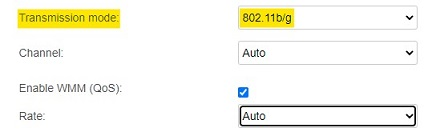

# WLAN Rate  [](https://www.python.org/) [](https://github.com/Naereen/badges)


## About
This simple script uses [selenium](https://pypi.org/project/selenium/) to automate the basic task of changing WLAN rate (speed) for controlling internet usage and quota. **only for Huawei - HG630 V2**. *You may try on other modems*<br>
- It will list your current rate.
- List all availble rates.


---
## Usage
- Clone the repo to your local machine.
```
git clone https://github.com/kfrawee/WLANRate.git
```
- Use the `requirements.txt` to install required libraries.
```
pip install -r requirements.txt
```
- ~~Install a comatable webdriver. *[ChromeDriver](https://sites.google.com/a/chromium.org/chromedriver/downloads)*~~ The script will automatically detect your Chrome browser version and will download the compatible webdriver.
- Modify [`login.py`](https://github.com/kfrawee/WLANRate/blob/master/login.py) with your login credentials.
- Check `default_gateway` in [`wlan_rate.py`](https://github.com/kfrawee/WLANRate/blob/master/wlan_rate.py). *By dafault `default_gateway = r'https://192.168.1.1/'`*
- **First**, make sure to change your Transmission mode to 802.11b/g to allow WLAN rate changing.
>
- In the directory, type `python wlan_rate.py` in your terminal or use `run.bat`.
--- 
